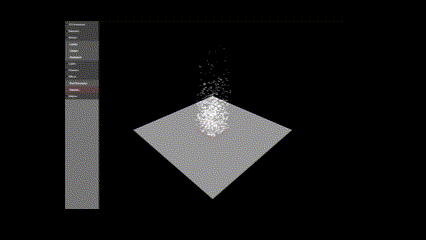

# **Example three.js**
A dummy example showcasing how to work with threejs - a ready made popular solution for webgl. This repository serves as a collection of interactive demos and experiments showcasing various features and capabilities of the Three.js library. Each demo or experiment focuses on different aspects of Three.js, such as geometry manipulation, materials, models, lights, cameras, post-processing effects, and helper utilities.



## **Purpose**

The purpose of this repository is to provide a curated collection of interactive demos and experiments built with Three.js. Whether you're a beginner exploring Three.js for the first time or an experienced developer looking for inspiration and examples, you'll find a variety of demos covering different topics to suit your interests and needs.

## **Getting started**

1. Install & Run

```sh
npm i
npm run start
```

> uses parcel to bundle the project and deliver via dev server.

## **Features**

- Geometry - explore different geometric shapes, custom meshes, and geometry manipulation techniques.
- Materials - experiment with various materials, textures, shaders, and material properties to achieve different visual effects.
- Models - load and display 3D models in different formats (e.g., OBJ, glTF) and interact with them in the scene.
- Lights - learn about different types of lights (e.g., directional, point, ambient) and how they affect the scene's illumination.
- Cameras - understand camera properties, perspectives, controls, and interactions within a Three.js scene.
- Effects - discover post-processing effects (e.g., bloom, blur) and particle effects to enhance the visual experience.
- Helpers - utilize helper utilities such as gizmos, widgets, and scene management tools to aid in development and debugging.

## **Navigation**

You can navigate between different demos and experiments using the navigation menu provided in the user interface. Each item in the menu represents a specific topic or demo, allowing you to quickly switch between them and explore different features of Three.js.

## **Contributing**

Contributions to this repository are welcome! If you have created a new demo or experiment or have suggestions for improvements, feel free to submit a pull request. Please ensure that your contributions adhere to the project's coding standards and guidelines.
